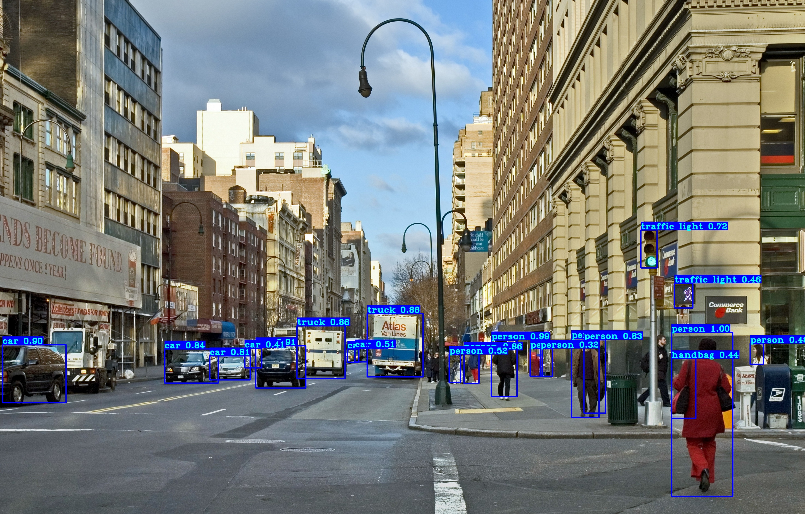
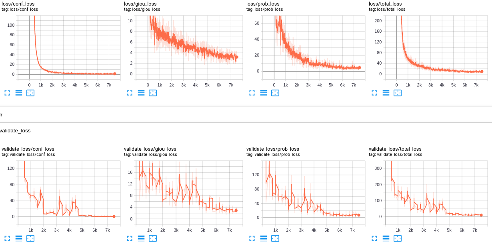
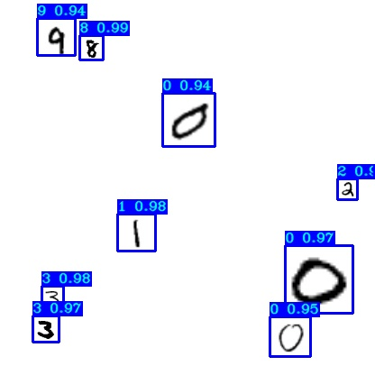

# TensorFlow-2.x-YOLOv3 tutorial

YOLOv3 implementation in TensorFlow 2.x, with support for training, transfer training.

## Installation
First, clode or download this GitHub repository.
Install requirements and download pretrained weights:
```
pip install -r ./requirements.txt

# yolov3
wget -P model_data https://pjreddie.com/media/files/yolov3.weights

# yolov3-tiny
wget -P model_data https://pjreddie.com/media/files/yolov3-tiny.weights
```

## Quick start
Start with using pretrained weights to test predictions on both image and video:
```
python detection_demo.py
```

<p align="center">
    </a>
</p>

## Quick training for custom mnist dataset
mnist folder contains mnist images, create training data:
```
python mnist/make_data.py
```
`./yolov3/configs.py` file is already configured for mnist training.

Now, you can train it and then evaluate your model
```
python train.py
tensorboard --logdir=log
```
Track training progress in Tensorboard and go to http://localhost:6006/:
<p align="center">
    </a>
</p>

Test detection with `detect_mnist.py` script:
```
python detect_mnist.py
```
Results:
<p align="center">
    </a>
</p>

## Custom Yolo v3 object detection training
Custom training required to prepare dataset first, how to prepare dataset and train custom model you can read in following link:<br>
https://pylessons.com/YOLOv3-TF2-custrom-train/

## Google Colab Custom Yolo v3 training
To learn more about Google Colab Free gpu training, visit my [text version tutorial](https://pylessons.com/YOLOv3-TF2-GoogleColab/)

## Yolo v3 Tiny train and detection
To get detailed instructions how to use Yolov3-Tiny, follow my text version tutorial [YOLOv3-Tiny support](https://pylessons.com/YOLOv3-TF2-Tiny/). Short instructions:
- Get YOLOv3-Tiny weights: ```wget -P model_data https://pjreddie.com/media/files/yolov3-tiny.weights```
- From `yolov3/configs.py` change `TRAIN_YOLO_TINY` from `False` to `True`
- Run `detection_demo.py` script.

## Yolo v3 Object tracking
To learn more about Object tracking with Deep SORT, visit [Following link](https://pylessons.com/YOLOv3-TF2-DeepSort/).
Quick test:
- Clone this repository;
- Make sure object detection works for you;
- Run object_tracking.py script
<p align="center">
    </a>
</p>

To be continued...
--------------------
- [x] Detection with original weights [Tutorial link](https://pylessons.com/YOLOv3-TF2-introduction/)
- [x] Mnist detection training [Tutorial link](https://pylessons.com/YOLOv3-TF2-mnist/)
- [x] Custom detection training [Tutorial link1](https://pylessons.com/YOLOv3-TF2-custrom-train/), [link2](https://pylessons.com/YOLOv3-TF2-custrom-images/)
- [x] Google Colab training [Tutorial link](https://pylessons.com/YOLOv3-TF2-GoogleColab/)
- [x] YOLOv3-Tiny support [Tutorial link](https://pylessons.com/YOLOv3-TF2-Tiny/)
- [X] Object tracking [Tutorial link](https://pylessons.com/YOLOv3-TF2-DeepSort/)
- [X] Mean Average Precision (mAP) [Tutorial link](https://pylessons.com/YOLOv3-TF2-mAP/)
- [ ] Converting to TensorFlow Lite
- [ ] Yolo v3 on Raspberry v3
- [ ] Yolo v3 on Android (Not sure about this)
- [ ] Convert to TensorRT model
- [ ] Generating anchors
- [ ] YOLACT: Real-time Instance Segmentation
- [ ] Model pruning (Pruning is a technique in deep learning that aids in the development of smaller and more efficient neural networks. It's a model optimization technique that involves eliminating unnecessary values in the weight tensor.)
- [ ] Yolo v4
